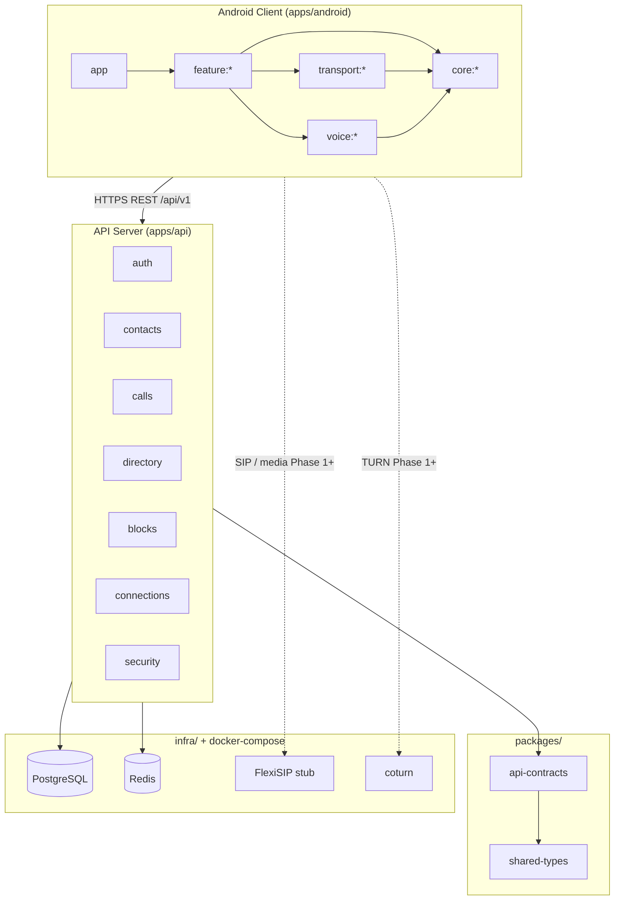
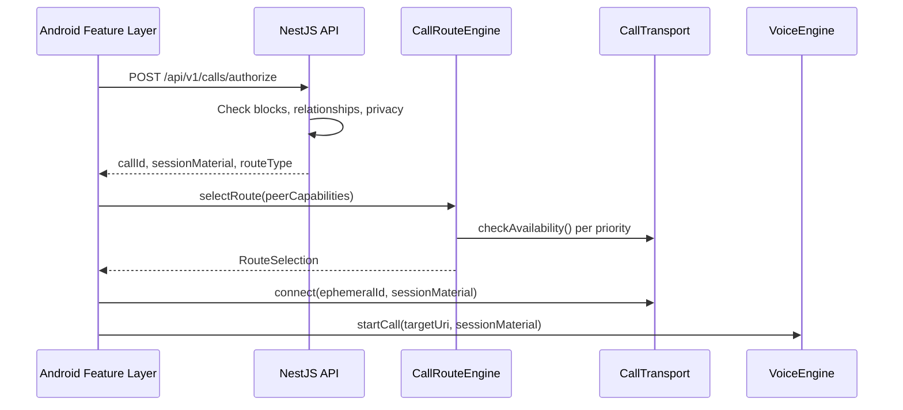

# Viro Reach — System Architecture (Phase 0)

## Overview

Viro Reach is a private voice calling network with an Android-first client and a server-authoritative backend. Phase 0 establishes architectural boundaries: modular Android Gradle projects, a NestJS API with PostgreSQL persistence, shared TypeScript contracts, pluggable call transports, and a VoIP SDK abstraction (`VoiceEngine`).

## Design principles

1. **Server-authoritative security** — Call authorization, blocking, and relationship checks happen on the API before the client selects a transport route.
2. **Privacy by default** — Contact discovery uploads HMAC-hashed phone numbers only; local discovery advertises rotating ephemeral IDs with no PII.
3. **Transport and voice isolation** — Feature code depends on `CallTransport` and `VoiceEngine` interfaces, not concrete SDKs or network stacks.
4. **Contract-first API** — `packages/api-contracts` and `packages/shared-types` define shapes consumed by both API and Android Retrofit client.
5. **Stub-first Phase 0** — Transports, Linphone, FlexiSIP, and NSD/mDNS are stubbed to prove interfaces and test privacy/routing logic.

## Monorepo layout

| Path | Role |
|------|------|
| `apps/android/` | Primary Kotlin multi-module Android application |
| `apps/api/` | NestJS 10 REST API with TypeORM |
| `apps/admin/` | Admin UI placeholder (`apps/admin/README.md`) |
| `packages/shared-types/` | Domain enums, error codes, discovery/call types |
| `packages/api-contracts/` | v1 endpoint paths and request/response interfaces |
| `infra/` | Postgres init, Dockerfiles, Caddy, coturn, FlexiSIP config stubs |
| `scripts/bootstrap.sh` | First-time environment setup |
| `docs/` | Architecture and specification documents |

## Android module structure

Declared in `apps/android/settings.gradle.kts`:

### Application

| Module | Path | Purpose |
|--------|------|---------|
| `:app` | `apps/android/app/` | Launcher, `MainActivity`, diagnostic screen |

### Core (`apps/android/core/`)

| Module | Key types |
|--------|-----------|
| `:core:model` | `DomainModels.kt` — enums, `KnownContact`, discovery models |
| `:core:network` | `ViroApiService.kt` — Retrofit API client |
| `:core:database` | `ViroDatabase.kt` — Room cache for known contacts |
| `:core:security` | `DeviceIdentityManager.kt`, `DeviceIntegrityProvider.kt` |
| `:core:designsystem` | `ViroTheme.kt` — Compose Material 3 theme |

### Features (`apps/android/feature/`)

| Module | Key types |
|--------|-----------|
| `:feature:auth` | `OtpProvider.kt` — OTP flow integration point |
| `:feature:contacts` | `ContactDiscoveryService.kt`, `PhoneNormalizer.kt` |
| `:feature:discovery` | `LocalNetworkDiscoveryService.kt`, `EphemeralIdGenerator.kt` |
| `:feature:calling` | `CallRouteEngine.kt` |
| `:feature:history` | Call history (scaffold) |
| `:feature:subscription` | Subscription UI (scaffold) |
| `:feature:settings` | Settings (scaffold) |

### Transport (`apps/android/transport/`)

| Module | Implementation | Route type |
|--------|----------------|------------|
| `:transport:lan` | `LanCallTransport.kt` | `LAN` |
| `:transport:wifidirect` | `WifiDirectCallTransport.kt` | `WIFI_DIRECT` |
| `:transport:internet` | `InternetSipCallTransport.kt`, `TurnRelayTransport.kt` | `INTERNET_P2P`, `TURN_RELAY` |

The `CallTransport` interface lives in `apps/android/transport/lan/src/main/kotlin/com/viroreach/transport/lan/CallTransport.kt` and is implemented by all transport modules.

### Voice (`apps/android/voice/`)

| Module | Purpose |
|--------|---------|
| `:voice:api` | `VoiceEngine.kt` — SDK-agnostic VoIP interface |
| `:voice:linphone` | `LiblinphoneVoiceEngine.kt` — Phase 0 stub adapter |

## Backend module structure

NestJS modules in `apps/api/src/app.module.ts`:

| Module | Controller | Service responsibilities |
|--------|------------|-------------------------|
| `AuthModule` | `auth.controller.ts` | OTP request/verify, JWT sessions, refresh rotation |
| `DevicesModule` | `devices.controller.ts` | Device registration, listing, revocation |
| `UsersModule` | `users.controller.ts` | `/me` profile read/update, Viro ID |
| `ContactsModule` | `contacts.controller.ts` | Hashed phone discovery |
| `DirectoryModule` | `directory.controller.ts` | Exact Viro ID lookup |
| `ConnectionsModule` | `connections.controller.ts` | Connection request/accept/reject/revoke |
| `BlocksModule` | `blocks.controller.ts` | Block/unblock users |
| `CallsModule` | `calls.controller.ts` | Server-side call authorization |
| `SecurityModule` | — | `SecurityService` — audit event logging |
| `HealthModule` | `health.controller.ts` | Liveness and readiness probes |

Cross-cutting:

- `common/exceptions/viro.exception.ts` — Structured API errors with `ApiErrorCode`
- `common/middleware/request-id.middleware.ts` — Request correlation IDs
- `common/utils/` — Phone normalization, Viro ID rules, HMAC hashing
- `database/migrations/001_initial_schema.sql` — Canonical schema
- `database/entities/*.entity.ts` — TypeORM entity mappings

## Shared packages

### `@viro-reach/shared-types`

Source: `packages/shared-types/src/index.ts`

Exports domain enums (`CallRouteType`, `CallStateMachineState`, `ContactRelationshipState`, `ApiErrorCode`, etc.) and shared interfaces (`ContactDiscoveryRequest`, `CallAuthorizeResponse`, `PublicProfile`).

### `@viro-reach/api-contracts`

Source: `packages/api-contracts/src/index.ts`

Defines `API_VERSION`, `API_BASE`, typed request/response bodies, and the `ENDPOINTS` registry used for documentation and client generation.

## Infrastructure

`docker-compose.yml` services:

| Service | Image / build | Port | Phase 0 role |
|---------|---------------|------|--------------|
| `postgres` | postgres:16-alpine | 5432 | Primary data store |
| `redis` | redis:7-alpine | 6379 | Reserved for rate limiting / sessions |
| `api` | `infra/docker/Dockerfile.api` | 3001 | Containerized API |
| `caddy` | caddy:2-alpine | 80, 443 | Reverse proxy stub |
| `coturn` | coturn/coturn | host network | TURN relay stub |

Signaling stub: `infra/flexisip/flexisip.conf`

## Call flow (Phase 0)

Authorization precedes route selection (see `CallRouteEngine` KDoc and `CallsService.authorize`).

## Phase 0 scope boundaries

**In scope:**

- Monorepo scaffolding and CI (`.github/workflows/ci.yml`)
- Full PostgreSQL schema and migrations
- Auth, discovery, directory, connections, blocks, call authorization APIs
- Android privacy model (ephemeral IDs, authorized resolver)
- Transport and voice abstractions with stub implementations
- Diagnostic UI proving discovery privacy

**Out of scope (later phases):**

- Production Compose UI and navigation
- Live Linphone SDK and FlexiSIP signaling
- Real NSD/mDNS and Wi-Fi Direct sessions
- Admin UI (`apps/admin/`)
- Push notifications and background call handling
- iOS client

## Related documents

- [DISCOVERY_PRIVACY.md](DISCOVERY_PRIVACY.md)
- [SECURITY_MODEL.md](SECURITY_MODEL.md)
- [CALL_ROUTING.md](CALL_ROUTING.md)
- [DATABASE_SCHEMA.md](DATABASE_SCHEMA.md)
- [API_CONTRACTS.md](API_CONTRACTS.md)
