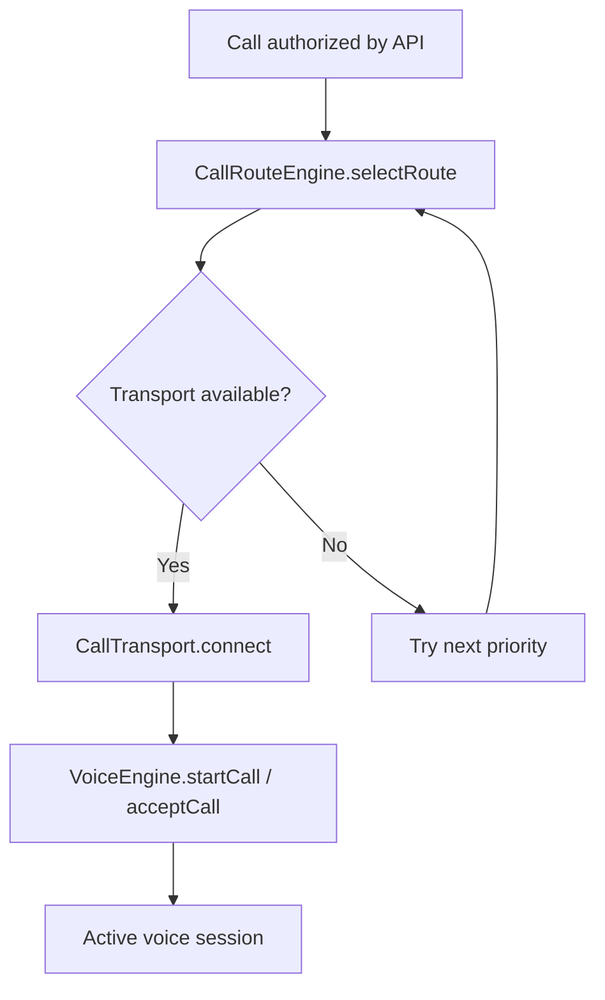

# Call Routing (Phase 0)

## Overview

Viro Reach separates **authorization**, **route selection**, **transport connection**, and **voice media** into distinct layers. Phase 0 implements the interfaces and selection logic with stub transports and a stub `VoiceEngine`; production will connect real NSD, Wi-Fi Direct, SIP, and Linphone SDK.



**Critical ordering:** Identity authorization happens on the server **before** `CallRouteEngine` runs. See KDoc in `CallRouteEngine.kt`.

## Core abstractions

### CallTransport

**Interface:** `apps/android/transport/lan/src/main/kotlin/com/viroreach/transport/lan/CallTransport.kt`

```kotlin
interface CallTransport {
    val routeType: CallRouteType
    suspend fun checkAvailability(): TransportAvailability
    suspend fun connect(peerEphemeralId: String, sessionMaterial: Map<String, String>): Result<Unit>
    suspend fun disconnect()
    fun getLatencyEstimateMs(): Int?
}
```

| Method | Responsibility |
|--------|----------------|
| `routeType` | Identifies transport (`LAN`, `WIFI_DIRECT`, etc.) |
| `checkAvailability` | Probe whether this path can be used now |
| `connect` | Establish transport session using server `sessionMaterial` |
| `disconnect` | Tear down transport |
| `getLatencyEstimateMs` | Optional estimate for route ranking |

All transport modules implement this interface, keeping the dependency direction stable (internet and wifidirect modules depend on `:transport:lan` for the interface definition).

### CallRouteEngine

**Implementation:** `apps/android/feature/calling/src/main/kotlin/com/viroreach/feature/calling/CallRouteEngine.kt`

```kotlin
class CallRouteEngine(private val transports: List<CallTransport>)
```

**Selection algorithm:**

1. Iterate routes in fixed priority order
2. Find transport matching `routeType`
3. Skip if `checkAvailability() != AVAILABLE`
4. Skip if `peerCapabilities` is non-empty and route not in set
5. Return first match with latency estimate

**Priority order (highest first):**

| Priority | `CallRouteType` | Module | Phase 0 availability |
|----------|-----------------|--------|----------------------|
| 1 | `LAN` | `:transport:lan` / `LanCallTransport` | Stub: always `AVAILABLE` |
| 2 | `WIFI_DIRECT` | `:transport:wifidirect` / `WifiDirectCallTransport` | Stub: `UNAVAILABLE` |
| 3 | `INTERNET_P2P` | `:transport:internet` / `InternetSipCallTransport` | Stub: `AVAILABLE` |
| 4 | `TURN_RELAY` | `:transport:internet` / `TurnRelayTransport` | Stub: `AVAILABLE` |

**Future route types** (defined in domain model, not yet implemented):

- `VIRO_MESH`
- `VIRO_RADIO`

### VoiceEngine

**Interface:** `apps/android/voice/api/src/main/kotlin/com/viroreach/voice/api/VoiceEngine.kt`

Isolates VoIP SDK from UI and feature modules.

| Category | Methods |
|----------|---------|
| Lifecycle | `initialize()`, `shutdown()`, `register()`, `unregister()` |
| Call control | `startCall()`, `acceptCall()`, `rejectCall()`, `endCall()` |
| Audio | `setMuted()`, `setSpeaker()`, `setAudioRoute()` |
| Observability | `callState: Flow<CallStateMachineState>`, `callEvents`, `getStatistics()` |

Supporting types: `SipCredentials`, `AudioRoute`, `VoiceCallEvent`, `CallStatistics`.

**Implementation:** `apps/android/voice/linphone/src/main/kotlin/com/viroreach/voice/linphone/LiblinphoneVoiceEngine.kt`

Phase 0 stub simulates state transitions (`CONNECTING` → `RINGING` → `ACTIVE` → `ENDED`) without real media.

## Transport implementations

### LanCallTransport

Path: `apps/android/transport/lan/.../LanCallTransport.kt`

- Route: `LAN`
- Latency estimate: 5 ms
- Phase 0: NSD/mDNS check stubbed; always reports available

### WifiDirectCallTransport

Path: `apps/android/transport/wifidirect/.../WifiDirectCallTransport.kt`

- Route: `WIFI_DIRECT`
- Latency estimate: 10 ms
- Phase 0: reports `UNAVAILABLE`; `connect()` returns failure

### InternetSipCallTransport

Path: `apps/android/transport/internet/.../InternetSipCallTransport.kt`

- Route: `INTERNET_P2P`
- Latency estimate: 50 ms
- Phase 0: stub success on connect

### TurnRelayTransport

Path: `apps/android/transport/internet/.../TurnRelayTransport.kt`

- Route: `TURN_RELAY`
- Latency estimate: 100 ms
- Infrastructure stub: `infra/coturn/turnserver.conf`, `docker-compose.yml` coturn service

## Server-side route authorization

`POST /api/v1/calls/authorize` — `apps/api/src/calls/calls.service.ts`

| Field | Description |
|-------|-------------|
| Request | `{ targetUserId, preferredRoute? }` |
| Response | `{ callId, authorized, expiresAt, routeType, sessionMaterial }` |
| Default route | `INTERNET_P2P` if `preferredRoute` omitted |
| Session material | `{ callId, signalingUrl }` — FlexiSIP domain from `FLEXISIP_DOMAIN` |

The server records `calls.route_type` and creates the call row before the client connects transport.

**Note:** Server default route (`INTERNET_P2P`) and client `CallRouteEngine` priority (LAN first) are intentionally independent in Phase 0. Production will reconcile via negotiated route in session material.

## Call state machine

Shared enum: `CallStateMachineState` in `packages/shared-types/src/index.ts` and `apps/android/core/model/.../DomainModels.kt`

| State | Meaning |
|-------|---------|
| `IDLE` | No active call |
| `RESOLVING_CONTACT` | Looking up callee |
| `SELECTING_ROUTE` | `CallRouteEngine` running |
| `AUTHORIZING` | Awaiting `/calls/authorize` |
| `CONNECTING` | Transport + voice setup |
| `RINGING` | Outbound ring / inbound offer |
| `ACTIVE` | Media connected |
| `ENDING` / `ENDED` | Teardown |
| Error states | `UNAUTHORIZED`, `UNREACHABLE`, `NETWORK_FAILED`, `PEER_REJECTED`, `BUSY`, `TIMEOUT`, `MEDIA_FAILED`, `SERVER_FAILED` |

## Presence and reachability (domain model)

`KnownContact` includes optional `presence` and `reachability` for UI:

| `PresenceState` | Indicates |
|-----------------|-----------|
| `LOCAL_NETWORK` | Peer on same LAN (ephemeral discovery) |
| `WIFI_DIRECT` | Wi-Fi Direct path |
| `VIRO_ONLINE` | Registered on server |
| `OFFLINE` | Default |

Phase 0 diagnostic screen sets `presence = LOCAL_NETWORK` for demo authorized peer.

## Signaling infrastructure (stubs)

| Component | Path | Role |
|-----------|------|------|
| FlexiSIP | `infra/flexisip/flexisip.conf` | SIP registrar/auth stub |
| coturn | `infra/coturn/turnserver.conf` | TURN relay for NAT traversal |
| Env | `FLEXISIP_DOMAIN`, `TURN_REALM`, `TURN_SECRET` | Configuration |

## Diagnostic integration

`DiscoveryDiagnosticScreen.kt` probes transport availability at startup:

```kotlin
LanCallTransport().checkAvailability()
WifiDirectCallTransport().checkAvailability()
InternetSipCallTransport().checkAvailability()
```

Displays availability badges alongside authorized nearby contacts.

## Unit tests

`apps/android/feature/calling/src/test/.../CallRouteEngineTest.kt`

| Test | Assertion |
|------|-----------|
| `prefers LAN over internet` | When both available, selects `LAN` |
| `falls back to TURN when direct paths unavailable` | Selects `TURN_RELAY` as last resort |

## Module dependency graph

```
:feature:calling
    └── :transport:lan (CallTransport interface)
    └── :core:model

:transport:internet
    └── :transport:lan

:transport:wifidirect
    └── :transport:lan

:voice:linphone
    └── :voice:api
    └── :core:model

:app (diagnostic)
    └── :feature:discovery
    └── :transport:lan, :transport:wifidirect, :transport:internet
```

## Phase 1 integration checklist

- [ ] Wire `CallRouteEngine` to post-authorization call flow
- [ ] Integrate Linphone SDK in `LiblinphoneVoiceEngine`
- [ ] Connect `LanCallTransport` to Android NSD
- [ ] Enable `WifiDirectCallTransport` with Wi-Fi Direct API
- [ ] Route `InternetSipCallTransport` through FlexiSIP
- [ ] Populate `call_quality` table from `VoiceEngine.getStatistics()`
- [ ] Align server `preferredRoute` with client-selected route

## Related documents

- [ARCHITECTURE.md](ARCHITECTURE.md)
- [SECURITY_MODEL.md](SECURITY_MODEL.md)
- [API_CONTRACTS.md](API_CONTRACTS.md) — `/calls/authorize`
- [DEPENDENCY_LICENSES.md](DEPENDENCY_LICENSES.md) — Linphone AGPL
- [DECISIONS.md](DECISIONS.md) — ADR-005, ADR-006
