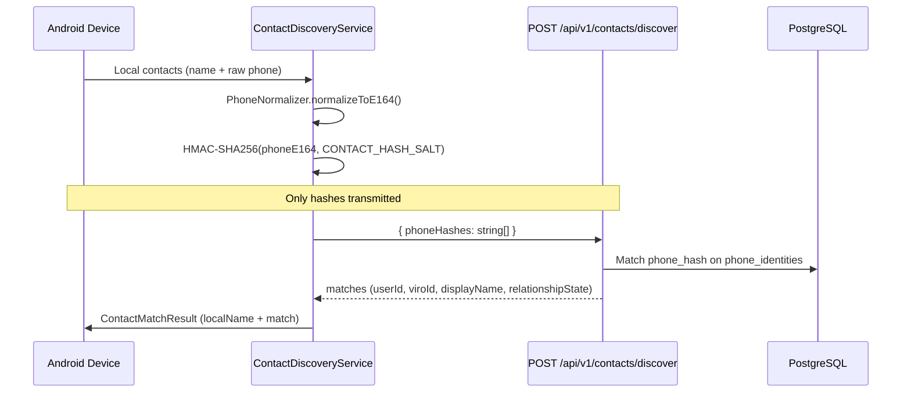
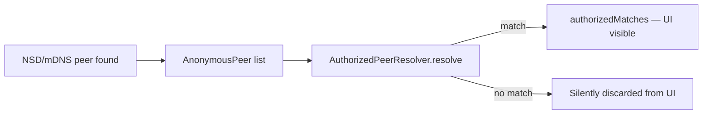

# Contact and Local Discovery Privacy (Phase 0)

## Purpose

Viro Reach supports two discovery paths:

1. **Server-side contact discovery** — Match local address book entries against registered users using HMAC-hashed phone numbers. Raw contact names and unverified numbers never leave the device.
2. **Local network discovery** — Detect nearby Viro Reach peers on LAN/Wi-Fi Direct using rotating ephemeral IDs. Peers remain anonymous until resolved against the user's authorized relationship set.

This document defines the privacy rules enforced in Phase 0 code.

## Contact discovery (server-side)

### Data flow



### Client implementation

| Component | Path | Behavior |
|-----------|------|----------|
| Phone normalization | `apps/android/feature/contacts/.../PhoneNormalizer.kt` | Basic E.164 normalization (Phase 0); production will use libphonenumber-android |
| Hashing | `apps/android/feature/contacts/.../ContactDiscoveryService.kt` | `HmacSHA256` with client-side salt matching server `CONTACT_HASH_SALT` |
| Batch limit | Same | `MAX_BATCH_SIZE = 200`, chunked requests |
| API client | `apps/android/core/network/ViroApiService.kt` | `discoverContacts(DiscoverBody)` |

### Server implementation

| Component | Path | Behavior |
|-----------|------|----------|
| Controller | `apps/api/src/contacts/contacts.controller.ts` | JWT required; validates max 200 hashes per request |
| Service | `apps/api/src/contacts/contacts.service.ts` | Matches verified `phone_identities.phone_hash`; excludes self, blocked users |
| Hash utility | `apps/api/src/common/utils/hash.util.ts` | `hashPhoneForMatching(phoneE164, salt)` |
| Match storage | `contact_matches` table | Stores `(user_id, matched_user_id, phone_hash, expires_at)` — not a copy of the address book |

### Privacy rules

| Rule | Enforcement |
|------|-------------|
| Contact names never uploaded | `ContactDiscoveryService` keeps `localName` on device; only hashes sent |
| Raw phone numbers not uploaded in discovery | Only HMAC-SHA256 hex digests in `phoneHashes[]` |
| Server stores verified E.164 at registration | `phone_identities.phone_e164` set during OTP verify, not from discovery batch |
| Discovery returns only submitted hashes | Server iterates request hashes; no enumeration of all users |
| Blocked users hidden | Both directions of `blocks` table checked |
| Self never returned | `identity.userId === userId` skipped |
| Batch size capped | 200 hashes (configurable via `CONTACT_DISCOVERY_MAX_BATCH`) |
| Suspicious enumeration logged | Batches > 90% of max trigger `SUSPICIOUS_ENUMERATION` security event |
| Match metadata TTL | `contact_matches.expires_at` = 90 days from discovery |

### Relationship states returned

From `packages/shared-types/src/index.ts`:

| State | Meaning |
|-------|---------|
| `PHONE_CONTACT` | Hash match, no accepted Viro connection |
| `PHONE_CONTACT_AND_CONNECTION` | Hash match plus accepted connection |
| `VIRO_CONNECTION` | Connection-only (not returned by current discovery path) |
| `BLOCKED` | Excluded from results |
| `UNKNOWN` | Default for unresolved peers |

## Local network discovery

### Threat model

On a shared LAN, broadcasting identifiable information (phone number, Viro ID, display name) enables passive profiling. Viro Reach advertises only:

```typescript
// packages/shared-types/src/index.ts
interface LocalDiscoveryAdvertisement {
  protocol: 'viro-reach';
  version: '1';
  ephemeralId: string;      // e.g. "vr-eph-a1b2c3d4"
  capabilities: TransportCapability[];  // ['voice']
}
```

No personally identifying fields appear in the advertisement payload.

### Ephemeral ID generation

Implementation: `apps/android/feature/discovery/EphemeralIdGenerator.kt`

| Property | Value |
|----------|-------|
| Format | `vr-eph-` + 8 hex chars (4 random bytes) |
| Entropy source | `SecureRandom` |
| Rotation interval | 5 minutes (configurable `rotationIntervalMs`) |
| PII encoded | None |

IDs rotate automatically on `getCurrentId()` when interval elapsed, or explicitly via `rotate()`.

### Anonymous vs authorized peers

Implementation: `apps/android/feature/discovery/LocalNetworkDiscoveryService.kt`



| Collection | Visible to user | Contents |
|------------|-----------------|----------|
| `_anonymousPeers` | No (internal counter only) | All discovered ephemeral IDs |
| `authorizedMatches` | Yes | Peers resolved to known contacts |

**Privacy guarantee:** Unknown nearby devices increment `getAnonymousPeerCount()` but never appear in the authorized list. Verified by `LocalDiscoveryPrivacyTest.kt`.

### Authorized peer resolution

`AuthorizedPeerResolver` is an injectable interface:

```kotlin
// apps/android/feature/discovery/LocalNetworkDiscoveryService.kt
interface AuthorizedPeerResolver {
    suspend fun resolve(ephemeralId: String): AuthorizedNearbyContact?
}
```

Phase 0 uses demo/test resolvers. Production will map ephemeral IDs to authorized contacts via server-issued binding material (future phase).

### Diagnostic demonstration

`apps/android/app/.../DiscoveryDiagnosticScreen.kt` simulates 7 anonymous peers with only 1 authorized (`vr-eph-demo01`), proving the privacy model in UI.

## Viro ID directory lookup

Separate from contact discovery; exact lookup only.

| Rule | Implementation |
|------|----------------|
| No wildcard or prefix search | `DirectoryService.exactLookup` — single normalized ID |
| No partial matches | `viro_id_normalized` unique index |
| Blocked users return 404 | Appears as "not found" to avoid leaking block state |
| Self lookup returns 404 | `profile.userId === requesterId` → null |

Path: `apps/api/src/directory/directory.service.ts`

## Environment variables

| Variable | Purpose |
|----------|---------|
| `CONTACT_HASH_SALT` | Server-side salt for `phone_identities.phone_hash` and matching |
| `CONTACT_DISCOVERY_MAX_BATCH` | Max hashes per request (default 200) |
| `CONTACT_DISCOVERY_RATE_LIMIT` | Reserved for per-user rate limits (Phase 1) |

Client must use the same salt convention as the server for discovery hashes to match stored `phone_hash` values.

## Phase 0 limitations

- NSD/mDNS discovery is stubbed (`LanCallTransport` returns `AVAILABLE` without real peer scan)
- `AuthorizedPeerResolver` is mocked in diagnostic screen and unit tests
- Phone normalization is basic; libphonenumber integration planned
- No encrypted discovery payload or signed ephemeral binding yet

## Related tests

| Test file | Validates |
|-----------|-----------|
| `apps/android/feature/discovery/.../LocalDiscoveryPrivacyTest.kt` | Unknown peers hidden; authorized resolution; ID rotation |
| `apps/api/src/contacts/contacts.service.spec.ts` | Batch limits, blocking, self exclusion, hash-only matching |
| `apps/android/feature/contacts/.../PhoneNormalizerTest.kt` | E.164 normalization |

## Related documents

- [SECURITY_MODEL.md](SECURITY_MODEL.md) — Auth and blocking
- [API_CONTRACTS.md](API_CONTRACTS.md) — `POST /contacts/discover`, `GET /directory/exact/:viroId`
- [DECISIONS.md](DECISIONS.md) — ADR-003, ADR-004, ADR-009
