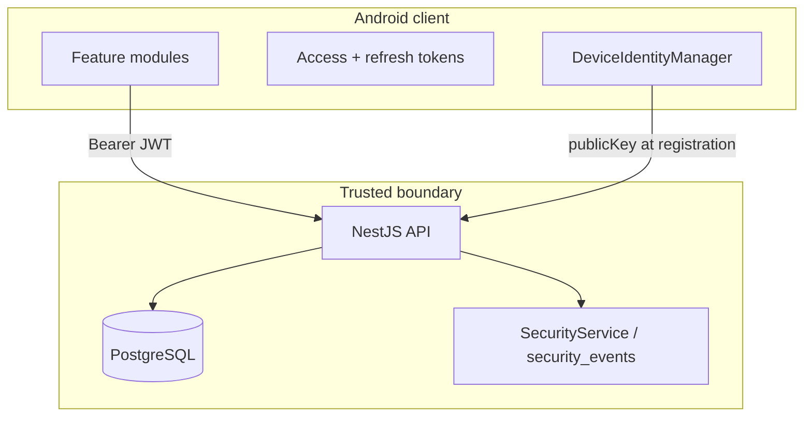

# Security Model (Phase 0)

## Overview

Viro Reach uses a **server-authoritative** security model. The API is the source of truth for identity, sessions, relationships, blocks, and call authorization. Clients hold credentials and perform local discovery, but cannot bypass server checks for calling or contact visibility.



## Authentication

### Phone OTP flow

| Step | Endpoint | Description |
|------|----------|-------------|
| 1 | `POST /api/v1/auth/otp/request` | Submit E.164 phone; receive `challengeId` |
| 2 | Provider sends OTP | Phase 0: `ConsoleOtpProvider` logs code to server console |
| 3 | `POST /api/v1/auth/otp/verify` | Submit code + device public key; receive tokens |

Implementation: `apps/api/src/auth/auth.service.ts`, `apps/api/src/auth/auth.controller.ts`

**OTP security controls:**

| Control | Default | Config |
|---------|---------|--------|
| Code length | 6 digits | Generated via `crypto.randomInt` |
| Code storage | HMAC-SHA256 hash only | `otp_challenges.code_hash` |
| Expiry | 300 seconds | `OTP_EXPIRES_SECONDS` |
| Max attempts | 5 | `OTP_MAX_ATTEMPTS` |
| Invalid attempt logging | `INVALID_OTP_ATTEMPT` event | `SecurityService.logEvent` |

### User and phone identity

On first successful OTP verify:

1. Create `users` row (`status = ACTIVE`)
2. Create `phone_identities` with verified E.164 and HMAC `phone_hash`
3. Create empty `profiles` row
4. Register `devices` row with client public key

Returning users update `phone_identities.verified_at` and register a new device per verify flow.

## Tokens and sessions

### Access token (JWT)

| Property | Value |
|----------|-------|
| Algorithm | HS256 (NestJS `@nestjs/jwt`) |
| Payload | `{ sub: userId, deviceId }` |
| Secret | `JWT_ACCESS_SECRET` |
| TTL | `JWT_ACCESS_EXPIRES_IN` (default 15m) |
| Transport | `Authorization: Bearer <token>` |

Validation: `apps/api/src/auth/strategies/jwt.strategy.ts`

- User must exist with `status === 'ACTIVE'`
- Device must exist and `revoked_at IS NULL`

### Refresh token

| Property | Value |
|----------|-------|
| Format | `<uuid>.<uuid>` (opaque) |
| Storage | HMAC hash in `sessions.refresh_token_hash` |
| TTL | 7 days (session `expires_at`) |
| Rotation | New refresh token issued on each refresh; previous session revoked |

**Refresh token reuse detection:**

If a revoked refresh token is presented, the entire session **family** is revoked and a `REFRESH_TOKEN_REUSE` critical security event is logged. Implementation: `AuthService.refreshToken`, `revokeSessionFamily`.

Hash function: `hashRefreshToken()` in `apps/api/src/common/utils/hash.util.ts` using `JWT_REFRESH_SECRET`.

### Logout

`POST /api/v1/auth/logout` (JWT required) revokes all active sessions for the `(userId, deviceId)` pair.

## Device identity

### Android keystore

`apps/android/core/security/src/main/kotlin/com/viroreach/core/security/DeviceIdentityManager.kt`

| Property | Value |
|----------|-------|
| Key alias | `viro_reach_device_key` |
| Algorithm | EC (P-256) in Android Keystore |
| Purpose | Sign / verify |
| Private key export | Never — hardware-backed when available |
| Registration payload | Base64-encoded SPKI public key sent at OTP verify |

### Server device record

Table: `devices` (see [DATABASE_SCHEMA.md](DATABASE_SCHEMA.md))

| Field | Purpose |
|-------|---------|
| `public_key` | Client-supplied key at registration |
| `platform` | `ANDROID`, `IOS`, or `WEB` |
| `app_version` | Client version string |
| `revoked_at` | Set on device revocation; invalidates JWT via strategy check |
| `integrity_status` | `UNKNOWN` in Phase 0; Play Integrity hook in `DeviceIntegrityProvider.kt` |

Device management endpoints: `apps/api/src/devices/devices.controller.ts`

- `POST /devices/register` — Additional device for authenticated user
- `GET /devices` — List non-revoked devices
- `DELETE /devices/:id` — Revoke device

## Blocking

### Server enforcement

Table: `blocks` — composite primary key `(blocker_user_id, blocked_user_id)`

Service: `apps/api/src/blocks/blocks.service.ts`

Blocking is **symmetric for visibility**:

| Operation | Blocked behavior |
|-----------|------------------|
| Contact discovery | Blocked user excluded from matches |
| Directory lookup | Returns null (404 to client) |
| Connection create | `CALL_TARGET_UNAVAILABLE` (404) |
| Call authorize | `CALL_TARGET_UNAVAILABLE` (404) — generic message |

`isBlocked(userA, userB)` checks both directions.

### API

| Method | Path | Auth |
|--------|------|------|
| POST | `/api/v1/blocks` | `{ blockedUserId }` |
| DELETE | `/api/v1/blocks/:userId` | — |

## Call authorization (server-authoritative)

All calls require `POST /api/v1/calls/authorize` before media setup.

Service: `apps/api/src/calls/calls.service.ts`

### Authorization conditions

A caller may reach `targetUserId` if **any** of:

| Condition | Check |
|-----------|-------|
| A — Phone contact | Row in `contact_matches` for `(caller, target)` |
| C — Viro connection | Accepted row in `viro_connections` (either direction) |
| B — Viro ID privacy | Target profile `allow_calls_from_viro_id === 'EXACT_ID_ALLOWED'` |

Default privacy: `CONNECTIONS_ONLY` (Condition B disabled).

### Denial responses

| Scenario | HTTP | Code |
|----------|------|------|
| No relationship | 403 | `CALL_NOT_AUTHORIZED` |
| Blocked | 404 | `CALL_TARGET_UNAVAILABLE` (intentionally vague) |
| Self-call | 403 | `CALL_NOT_AUTHORIZED` |

Successful authorization creates a `calls` row and returns `callId`, `expiresAt` (5 minutes), `routeType`, and `sessionMaterial`.

**Client rule:** `CallRouteEngine` selects transport only after authorization succeeds (see [CALL_ROUTING.md](CALL_ROUTING.md)).

## Viro ID security

Normalization: `apps/api/src/common/utils/viro-id.util.ts`

- Strip leading `@`, lowercase
- Pattern: `^[a-z0-9][a-z0-9._]{2,29}$`
- Stored as `profiles.viro_id` (display) and `profiles.viro_id_normalized` (unique index)

Duplicate IDs rejected with `DUPLICATE_VIRO_ID` (409).

Directory is **exact match only** — no search, no enumeration (see [DISCOVERY_PRIVACY.md](DISCOVERY_PRIVACY.md)).

## Security event audit log

Table: `security_events`

Service: `apps/api/src/security/security.service.ts`

| Event type | Severity | Trigger |
|------------|----------|---------|
| `REFRESH_TOKEN_REUSE` | CRITICAL | Revoked refresh token reused |
| `SUSPICIOUS_ENUMERATION` | MEDIUM | Large contact discovery batch |
| `INVALID_OTP_ATTEMPT` | LOW | Wrong OTP code |
| `RATE_LIMIT_EXCEEDED` | — | Throttler (configured in `AppModule`) |
| `DEVICE_REVOKED` | — | Reserved |
| `SESSION_REVOKED` | — | Reserved |
| `BLOCKED_CALL_ATTEMPT` | — | Reserved |

Types defined in `packages/shared-types/src/index.ts`.

## Rate limiting

`@nestjs/throttler` configured in `apps/api/src/app.module.ts`:

| Setting | Default |
|---------|---------|
| TTL | 60 seconds (`RATE_LIMIT_TTL_SECONDS`) |
| Limit | 100 requests (`RATE_LIMIT_MAX_REQUESTS`) |

## API error format

`ViroException` returns structured body:

```json
{
  "code": "CALL_NOT_AUTHORIZED",
  "message": "You are not authorized to call this person."
}
```

Codes enumerated in `ApiErrorCode` (`packages/shared-types/src/index.ts`).

## Network security (Android)

- `android:allowBackup="false"` in `AndroidManifest.xml`
- `network_security_config.xml` for certificate pinning (Phase 0 baseline)
- TLS required for production API; local dev may use cleartext to localhost

## Admin roles (future)

Defined but not enforced in Phase 0:

`USER`, `SUPPORT`, `ADMIN`, `SECURITY_ADMIN` — see `apps/admin/README.md`

## Phase 0 gaps

- No refresh token binding to device signature
- Play Integrity stub only (`DeviceIntegrityProvider.kt`)
- Call events endpoint accepts POST but does not persist (`calls.controller.ts`)
- Redis configured but not yet used for session denylist
- No mTLS or certificate pinning enforcement in API

## Related documents

- [DISCOVERY_PRIVACY.md](DISCOVERY_PRIVACY.md)
- [CALL_ROUTING.md](CALL_ROUTING.md)
- [API_CONTRACTS.md](API_CONTRACTS.md)
- [DECISIONS.md](DECISIONS.md) — ADR-002, ADR-008
